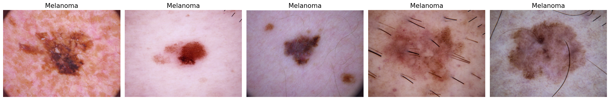

# Skin Cancer Classification Project

## Overview
This project aims to classify skin cancer using the HAM10000 dataset, leveraging Convolutional Neural Networks (CNN) and Support Vector Machines (SVM). It addresses the challenge of imbalanced data and explores various techniques to enhance model performance across 7 different categories of skin lesions.

## Dataset
The HAM10000 dataset consists of 10,000 training images and 1,000 test images, categorized into 7 types of skin lesions.

## Data Pre-processing
The data pre-processing steps include:
- **Image Resizing:** Resizing all images to a uniform size for consistent input to the models.
- **Normalization:** Normalizing pixel values for better model convergence.
- **Data Augmentation (for CNN):** Using image data generators to augment the dataset, creating variations of the images to address class imbalance.
- **Dimensionality Reduction (for SVM):** Applying PCA for reducing the number of features while retaining essential information.

## Models and Techniques
### Convolutional Neural Networks (CNN)
1. **CNN with Normal Data:** Using standard dataset.
2. **CNN with Data Image Generator:** Employing image data generator for augmented data.

### Support Vector Machines (SVM)
1. **SVM with PCA:** Dimensionality reduction using PCA.
2. **SVM with GridSearch and SMOTE:** Tuning hyperparameters with GridSearch and addressing class imbalance with SMOTE.
3. **SVM with Reduced Image Size and Image Data Generator:** Using reduced image size and data augmentation.

## Requirements
- Python 3.x, TensorFlow, scikit-learn, imbalanced-learn, OpenCV, NumPy, Pandas, Matplotlib, seaborn

## Installation

pip installtensorflowscikit-learnimbalanced-learnopencv-python numpy pandas matplotlib seaborn

## Usage
1. Clone the repository and navigate to the project directory.
2. Download and place the HAM10000 dataset in the data folder.
3. Run CNN and SVM models using the provided scripts.
   - For Both models: `Skin_Classification.ipynb`

## Contributing
Contributions to this project are welcome. To contribute:
1. Fork the repository.
2. Create a new branch for your feature or fix.
3. Implement your changes.
4. Submit a pull request.

## Contact
For any queries, suggestions, or contributions, please contact [erdemarslan@sabanciuniv.edu].
